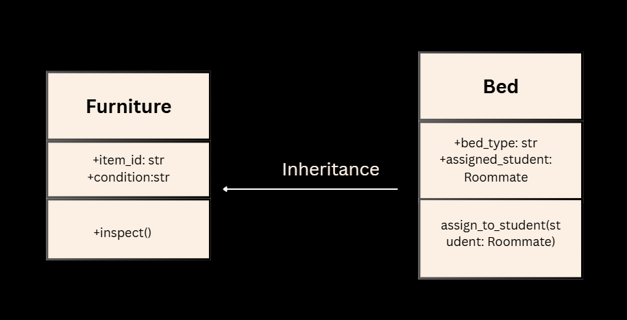
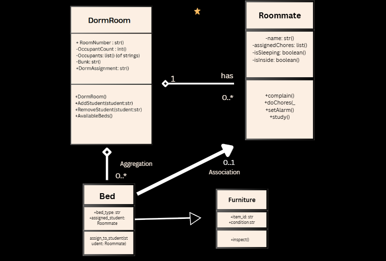
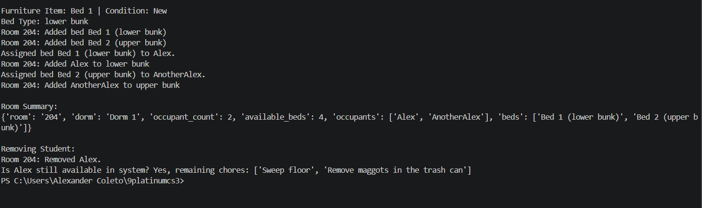
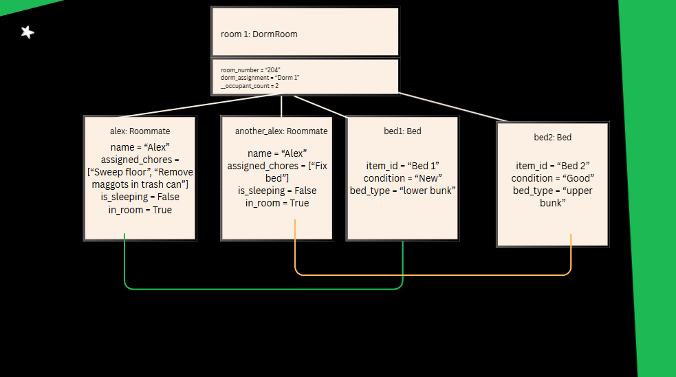

# Advanced Class Relationships
## Previous Activities
[classAttrib](https://github.com/amcoleto/9platinumcs3/blob/main/q1/classAttributesMethods.md)
[classRel](https://github.com/amcoleto/9platinumcs3/blob/main/q1/classRelationships.md)
## Existing System Description:
The system exhibits properties and actions in a designated dorm room ('DormRoom'), and having an ownership on a student occupant ('Roommate'). 'Roommate' exhibits individual students' data like their name, what 'Roommate' can do include chores assigned, studying, setting alarms, and complaining. Meanwhile, the dorm room 'DormRoom' class has an ownership on 'Roommate'. 'DormRoom' has its room number, dorm assignments, and occupant count. It can do adding or removing 'Roommate' objects, tracking bunk bed aassignments as well as bed capacity in a room.

## Inheritance Relationship
Parent: Furniture
Child: Bed
Explanation: A bed is a specific type of furniture in a dorm. In a dorm room, overall furniture will share properties like 'condition' and 'ID', but introduce properties like assigned students and the bed type; therefore, 'Furniture' inherits 'Bed'.

## Inheritance UML

## Composition/Aggregation
Relationship: Aggregation 
Explanation: 'DormRoom' is like a container for 'Roommate' or residents, as well as 'Bed'. Additionally, they will still exist even if they are unassigned or 'DormRoom' is destroyed.
## Advanced UML Diagram

## Python Implementation
[Source Code](advancedRelationships.py)
## Test Run

## Object Diagram

## Reflection
1. Why did you choose your inheritance relationship? Explain why your child class is a type of your
parent class.

I chose Bed as a child class of my parent class Furniture because bed is a highly relevant and specific category of a furniture in a dorm. It also inherits the properties of Furniture: the item_id and condition, while adding features for arrangements of where one sleeps and the assigned student of that bed. 

2. How did inheritance reduce duplicate code? Identify attributes or methods that were reused.

Inheritance made Bed directly inherit furnitures' properties like item id and condition as well as a method, particularly inspect(). Overall, inheritance made code less repetitive through avoidance of rewriting properties (id, condition) and methods. 

3. Why is your HAS-A relationship Composition or Aggregation? Explain the lifecycle relationship
between the two objects.

It is Aggregation. DormRoom, Roommate, and Bed have separate independent lifecycles. Students and beds already exist in the system before being assigned. Even if DormRoom is removed or a student is ejected, Roommate and Bed will still be intact independently.

4. What is the difference between Association from Part III and the advanced relationship you
implemented?

The difference between this activity and the previous activity is the change from using dictionary of strings to objects. In part 3, dictionaries were used, like {"Alex", "lowerbunk"}. However, in part 4, object instantiations were used, where the Bed links directly with a Roommate by one of its datafields. Additionally, part 4 also adds an IS-A relationship, where Bed is inheriting from Furniture.

5. How does your design follow the DRY principle?

It follows the DRY principle by sharing the furniture's datafields in Furniture class instead of duplicating code. In the code, one example is inspecting item condition. This is defined in Furniture, and is inherited by Bed, reducing redundant code, which follow the DRY principle.