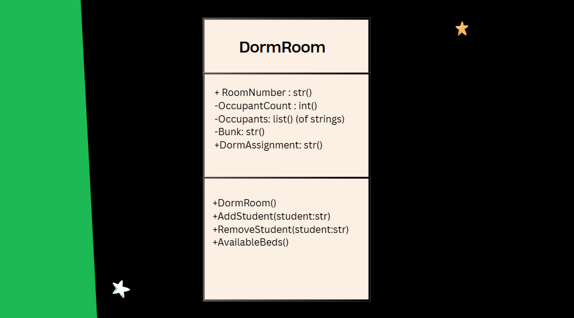
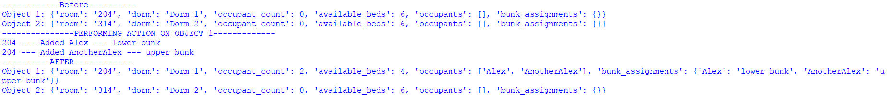
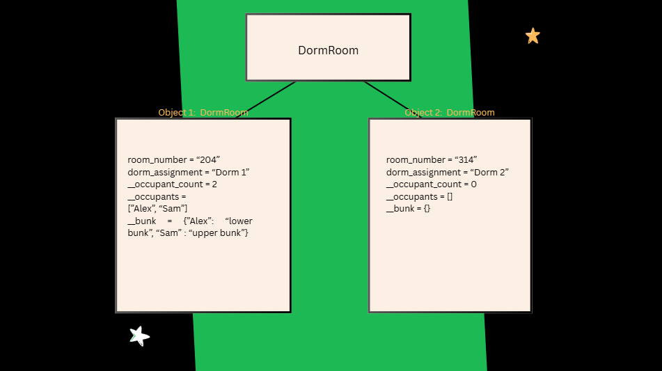

# Class Attributes and Methods
## Previous Design
Link to my previous activity:
([classObjectUML.md](https://github.com/amcoleto/9platinumcs3/blob/main/q1/classObjectUML.md))
## Design Revision
Changes from my previous design: 
- Added a new data field/attribute (DormAssignment)
## Visibility Decisions
| Attribute      | Data Type             | Visibility | Reason                                                                                              |
|----------------|-----------------------|------------|-----------------------------------------------------------------------------------------------------|
| RoomNumber     | String                | Public     | Uniquely identifies the room. Outside systems need to see the room number to find it                |
| OccupantCount  | Integer               | Private    | Should be modified inside when student count in the room is increased/decreased                     |
| Occupants      | List of Strings       | Private    | The list should not be modified outside. It should happen directly through the class' methods       |
| Bunk           | Dictionary of Strings | Private    | Bed assignments happen inside the room. Making it public could result in two people in the same bed |
| DormAssignment | String                | Public     | Outside systems need to know which building a room belongs to                                       |
## Updated UML Class Diagram

## Python Implementation
[View Python Source](classImplementation.py)
## Test Run

## Object Diagram

## Analysis
### Why did you make your chosen attribute private? 
I made these: `Occupants`, `OccupantCount`, and `Bunk` set to private, in order in preventing the outside parts of the program directly alter data internally with no validation. If these were public, then it would not work properly. Example, a script outside could add occupants without updating. Uitlizing private attributes are one foundation of the pillar encapsulation. Data remains intact through different methods.

### Which method changes the state of your object?
The add_student() method alters the state of the object. 

### How did your two objects demonstrate that instances are independent?
### What is the difference between your class diagram and your object diagram?