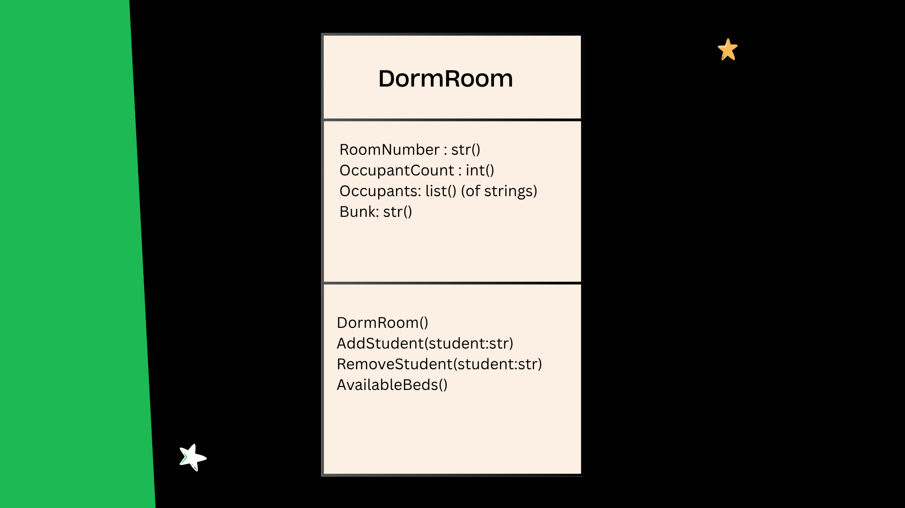

# SG4 - Understanding Classes and Objects
## Class Name: DormRoom
## Class Description: This class represents a dorm room in PSHS. It has the room number, number of occupants, name of the occupants, and the place where the occupant sleeps (single, upper bunk, or lower bunk). This class can also add students, remove students, and where the available beds are in a room.
## Properties
| Property      | Data Type                      | Description                                                                          |
|---------------|--------------------------------|--------------------------------------------------------------------------------------|
| RoomNumber    | String                         | Determines the room number of the dorm room. It provides its own unique identity.    |
| OccupantCount | Integer                        | The number of occupants in a dorm room.                                              |
| Occupants     | List of Strings                | Names of occupants through a list                                                    |
| Bunk          | Dictionary of strings          | Determines whether the occupant is in the lower bunk, upper bunk, or in a single bed |
| DormAssignment| String                         | Identifies what dorm assignment the room is (ex: "Dorm 1", "Dorm 2", etc.)           |

## Methods
| Method                     | Description                                        |
|----------------------------|----------------------------------------------------|
| DormRoom()                 | A constructor which initializes an object.         |
| AddStudent(student:str)    | Adds a student to a dorm room.                     | 
| RemoveStudent(student:str) | Removes a student from a dorm room.                |
| AvailableBeds()            | Returns the beds and the location where available. |
## Class Diagram

## Design Explanation
### Why did you choose this class?
I chose this class because it contains a large dataset and has applicable data field, as well as methods. 

### Which property is the most important? Why?
For me, the most important property is the RoomNumber. It serves like the 'identity' of a dorm room, since it provides a unique number sequence. For example, room 204 and 314 are distinguished as separate rooms within the dorm.

### Which method is the most useful? Why?
Through my lens, the most important method is the constructor or DormRoom(). It initializes an object. Without it, there will be no object for the class to inherit, and may ultimately lose the purpose of class.