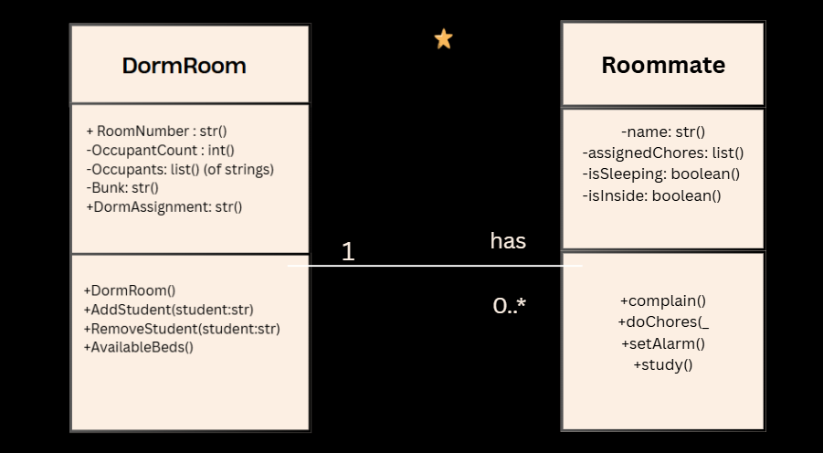
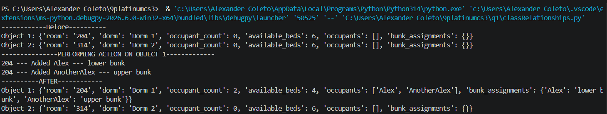
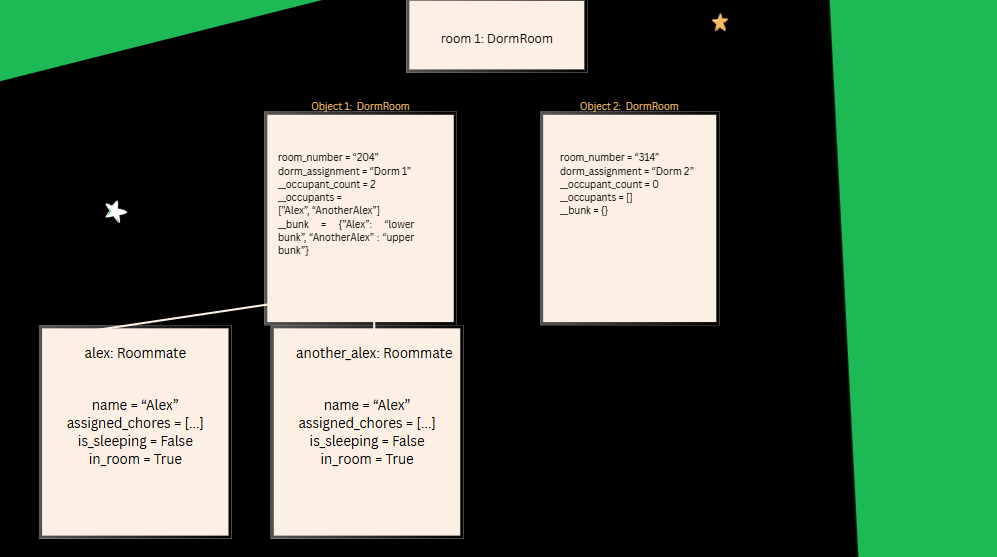

# Class Relationships: Association and Multiplicity
## Previous Work
([Part I - Classes and Objects](https://github.com/amcoleto/9platinumcs3/blob/main/q1/classObjectUML.md))
([Part II - Class Attributes and Methods](https://github.com/amcoleto/9platinumcs3/blob/main/q1/classAttributesMethods.md))
## Existing Class
Class: DormRoom
Description: This class represents a dorm room in PSHS. It has the room number, number of occupants, name of the occupants, and the place where the occupant sleeps (single, upper bunk, or lower bunk). This class can also add students, remove students, and where the available beds are in a room.
## New Related Class
Class: Roommate
Description: This class represents a roommate in the dorm room. The class has the roommate's name, assigned chores, whether sleeping, and whether the roommate is inside the room. This class can also complain, do chores, set alarm, and study. 
## Association
Relationship: A DormRoom HAS-A Roommate
Explanation: A DormRoom can be associated with one or many Roommates, which represents the students living in that dorm room.
## Multiplicity
Multiplicity: 1 to 0..*
Explanation: A dorm room can have zero to six occupants. While a dorm room can be empty, partially full, or full, a roommate must belong to a room.
## UML Class Relationship Diagram

## Python Implementation
[View Python Source](classRelationships.py)
## Test Run

## Object Relationship Diagram

## Analysis
### What is the association between your two classes? 
The association by the two classes exhibit a HAS-A association. 
### What multiplicity did you choose and why?
1 to 0..* multiplicity. 

The DormRoom has the multiplicity of 1 because every instance of a Roommate must be assigned to a dorm room.
Then, the Roommate has the multiplicity of 0..* since a dorm room can be empty, partially full or occupied, or fully occupied.

### How did you implement the relationship in Python?
Roommate object was passed as parameters that included the occupants, one in particular was the add_student() method of the class DormRoom. In DormRoom, these instantiations are encapsulated in a private list attribute, adding the student in occupants in the room: self.__occupants.append(student)

### Why did you store an object reference instead of copying its data?
Storing an object reference instead of copying its data makes sure that all changes made on Roommate (like a method such as sleeping or doing a chore) will encapsulate in the dorm room with no duplicates in the memory. 

### If your relationship uses many, why is a list appropriate?
A list is appropriate because it can grow and shrink as more or fewer roommates are added or removed through simple built-in functions like append() and pop().