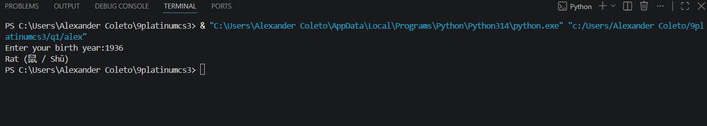

# Zodiac Activity

## Actual Code:
```
def zodiac_sign(year): 
    if year < 1900: return "Invalid Year, it should not be earlier than 1900." 
    zodiaclist = ["Rat (鼠 / Shǔ)", "Ox (牛 / Niú)", "Tiger (虎 / Hǔ)", "Rabbit (兔 / Tù)", "Dragon (龙 / Lóng)", "Snake (蛇 / Shé)", "Horse (马 / Mǎ)", "Goat (羊 / Yáng)", "Monkey (猴 / Hóu)", "Rooster (鸡 / Jī)", "Dog (狗 / Gǒu)", "Pig (猪 / Zhū)"] 
    indexarr = (year-1900) % 12 
    return zodiaclist[indexarr] 

if __name__ == "__main__": 
    year = int(input("Enter your birth year:")) 
    print(zodiac_sign(year))
```

## Screenshot:
